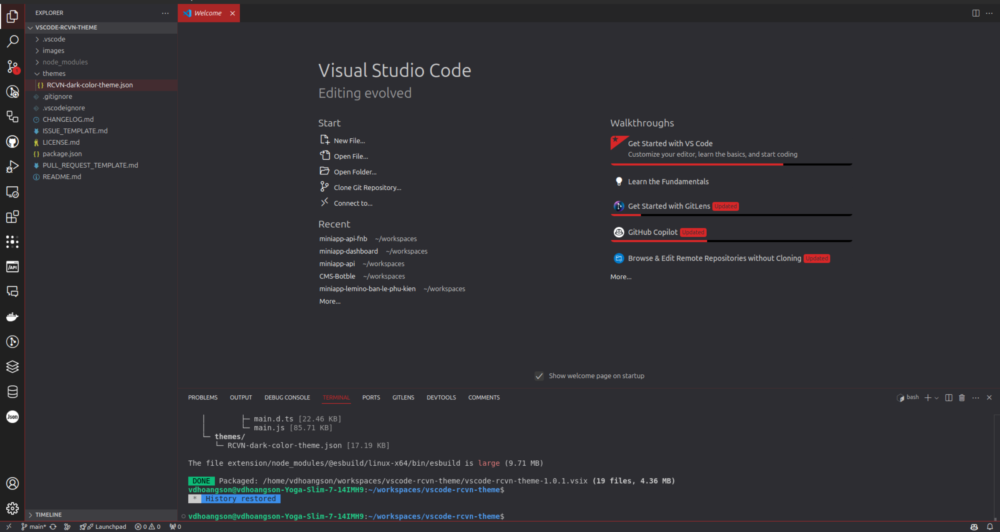

# RCVN VSCode Theme

See the [CHANGELOG](CHANGELOG.md) for the latest changes.

## Dark Theme

## Usage

Select the theme and go!

## Installation

1. Open **Extensions** sidebar panel in Visual Studio Code. `View → Extensions`
1. Search for `RCVN Theme`
1. Click **Install**
1. Click **Reload**
1. File > Preferences > Color Theme > **RCVN Theme (Dark)**
1. Optional: Use the recommended settings below for best experience

## Feedback

If you have suggestions, please [open an issue](https://github.com/vdhoangson/vscode-rcvn-theme/issues) or better yet, a [pull request](https://github.com/vdhoangson/vscode-rcvn-theme/pulls).

Be nice.

## Authors

Authored by [vdhoangson](https://vdhoangson.com)
